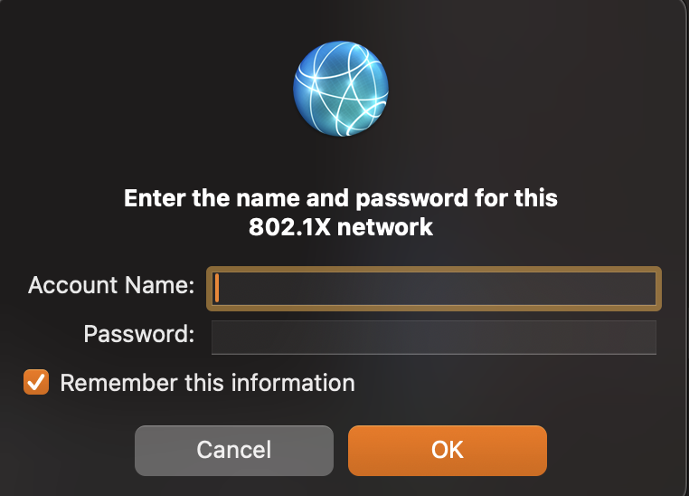

---
title = "Welcome to Deck"
author = "deck"
theme = "hacker"
background = "aurora"
---

# Deck

<!-- layout: center -->

Terminal presentations with style.

---

## What is Deck?

- A tiny, single-binary presentation tool
- Written in Rust for maximum performance
- Hacker aesthetic by default
- Markdown-powered slides

<!-- note: This is a speaker note! Only visible in presenter mode (press p). -->

---

## Progressive Reveal

- Points appear one at a time
- Each keypress reveals the next bullet
- Keeps your audience focused
- No more reading ahead!

---

## Column Layouts

::: columns
::: left
**Left Side**

Great for comparisons,
before/after views,
or side-by-side content.
:::
::: right
**Right Side**

Put diagrams here,
code examples,
or contrasting ideas.
:::
:::

---

## Code Blocks

```rust
use std::collections::HashMap;

fn fibonacci(n: u64) -> u64 {
    let mut cache: HashMap<u64, u64> = HashMap::new();
    fib_cached(n, &mut cache)
}

fn fib_cached(n: u64, cache: &mut HashMap<u64, u64>) -> u64 {
    if n <= 1 { return n; }
    if let Some(&val) = cache.get(&n) { return val; }
    let result = fib_cached(n - 1, cache) + fib_cached(n - 2, cache);
    cache.insert(n, result);
    result
}
```

Syntax-highlighted with animated typewriter entrance.

---

## Inline Images



Images auto-detect your terminal: Kitty protocol, Sixel, or half-block fallback.

---

## Background: Matrix

<!-- background: matrix -->

*Falling characters with fading trails*

---

## Background: Plasma

<!-- background: plasma -->

*Sine interference pattern*

---

## Background: Lissajous

<!-- background: lissajous -->

*Parametric curve with fading trail*

---

## Background: Spiral

<!-- background: spiral -->

*Rotating polar coordinate arms*

---

## Background: Wave

<!-- background: wave -->

*Concentric ripple interference*

---

## Background: Rain

<!-- background: rain -->

*Gentle vertical drops*

---

## Background: Noise

<!-- background: noise -->

*Value-noise cloudscape*

---

## Background: Lattice

<!-- background: lattice -->

*Rotating grid intersections*

---

## Background: Orbit

<!-- background: orbit -->

*Particles circling the centre*

---

## Centered Content

<!-- layout: center -->

*"The best presentations are the ones
where every slide earns its place."*

---

# Thank You!

<!-- background: aurora -->
<!-- layout: center -->

Press ? for help  /  Press q to quit

---
